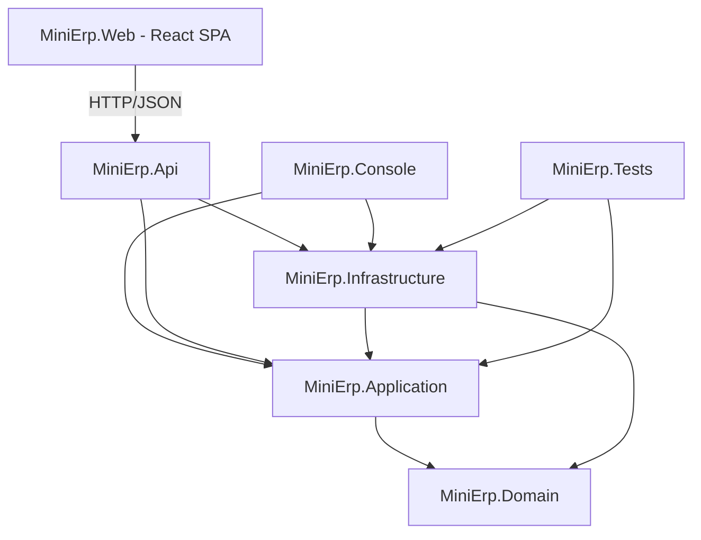

# 📦 Mini ERP em C#

Projeto de estudos evoluído de um console app para uma **API REST em ASP.NET Core**, organizada em camadas, com Entity Framework Core, SQLite, testes automatizados e um **frontend SPA em React + TypeScript** (`MiniErp.Web`).

---

## 🎯 Objetivos

- Praticar C#, POO e arquitetura em camadas.
- Construir uma API REST profissional com ASP.NET Core.
- Aplicar Repository Pattern, injeção de dependência, DTOs e validação.
- Preparar o backend para consumo por um frontend React (próxima sprint).

---

## 🏗️ Arquitetura

Camadas inspiradas em Clean Architecture / Onion Architecture:

- **MiniErp.Domain** — entidades e regras de negócio intrínsecas (`Produto`, `Cliente`, `Venda`, `ItemVenda`).
- **MiniErp.Application** — casos de uso: DTOs, interfaces (repositórios, unit of work, services), services, validators (FluentValidation) e exceptions de negócio.
- **MiniErp.Infrastructure** — Entity Framework Core (`MiniErpContext`), implementação dos repositórios, `UnitOfWork` e migrations.
- **MiniErp.Api** — ASP.NET Core Web API: controllers, middleware de exceções, Swagger, CORS e configuração de DI.
- **MiniErp.Console** — aplicativo console original, agora consumindo as mesmas camadas de Application/Infrastructure via injeção de dependência (mantido como demonstração histórica).
- **MiniErp.Tests** — testes xUnit dos services de Produto e Venda.
- **MiniErp.Web** — SPA em React + TypeScript (Vite) que consome a API via HTTP, sem acoplamento a nenhuma camada .NET.

Regra importante: os **controllers não contêm regra de negócio** — apenas orquestram DTOs e chamam os services da camada Application. As regras vivem nas entidades (`Domain`) e nos services (`Application`).



---

## 🚀 Tecnologias

### Backend
- C# / .NET 10
- ASP.NET Core Web API
- Entity Framework Core 10 + SQLite
- FluentValidation
- Swagger / Swashbuckle
- xUnit

### Frontend (`MiniErp.Web`)
- React 19 + TypeScript
- Vite
- React Router
- TanStack Query
- Axios
- Tailwind CSS v4
- React Hook Form + Zod (`@hookform/resolvers`)
- Recharts
- Lucide React
- Vitest + React Testing Library

---

## 📂 Estrutura de pastas

```
minierp/
├── MiniErp.sln
├── src/
│   ├── MiniErp.Domain/
│   │   └── Entities/            (Produto, Cliente, Venda, ItemVenda)
│   ├── MiniErp.Application/
│   │   ├── DTOs/                (Produtos, Clientes, Vendas, Dashboard, Common)
│   │   ├── Interfaces/          (Repositories, UnitOfWork, Services)
│   │   ├── Services/
│   │   ├── Validators/
│   │   └── Exceptions/
│   ├── MiniErp.Infrastructure/
│   │   ├── Persistence/         (MiniErpContext, UnitOfWork)
│   │   ├── Repositories/
│   │   └── Migrations/
│   ├── MiniErp.Api/
│   │   ├── Controllers/
│   │   ├── Middlewares/
│   │   └── Program.cs
│   ├── MiniErp.Console/
│   └── MiniErp.Web/              (SPA React + TypeScript)
│       ├── .env.example
│       ├── src/
│       │   ├── api/              (client.ts, produtosApi, clientesApi, vendasApi, dashboardApi)
│       │   ├── components/
│       │   │   ├── layout/       (AppLayout, Sidebar, Header)
│       │   │   ├── ui/           (Button, Input, Modal, ConfirmDialog, Pagination, ...)
│       │   │   ├── feedback/     (LoadingSpinner, Skeleton, ErrorState, EmptyState)
│       │   │   └── forms/        (ProdutoForm, ClienteForm, NovaVenda, ...)
│       │   ├── pages/            (Dashboard, Produtos, Clientes, Vendas, NotFound)
│       │   ├── hooks/
│       │   ├── schemas/          (validação Zod)
│       │   ├── types/            (contratos TypeScript espelhando os DTOs da API)
│       │   ├── utils/            (formatação pt-BR, extração de erros)
│       │   ├── routes/
│       │   ├── App.tsx
│       │   └── main.tsx
│       └── README.md
└── tests/
    └── MiniErp.Tests/
```

---

## ▶️ Como executar

### Restaurar e compilar

```bash
dotnet restore
dotnet build
```

### Rodar os testes

```bash
dotnet test
```

### Criar/atualizar o banco SQLite

```bash
dotnet ef database update --project src/MiniErp.Infrastructure --startup-project src/MiniErp.Api
```

### Executar a API

```bash
dotnet run --project src/MiniErp.Api
```

Abra o Swagger em `http://localhost:<porta>/swagger`.

### Executar o console (opcional)

```bash
dotnet run --project src/MiniErp.Console
```

---

## 💻 Frontend (MiniErp.Web)

O frontend é uma SPA independente que consome a API via HTTP — veja detalhes completos em [`src/MiniErp.Web/README.md`](src/MiniErp.Web/README.md).

### Configurar o `.env`

```bash
cd src/MiniErp.Web
cp .env.example .env
```

O `.env` define a URL da API consumida pelo frontend:

```
VITE_API_URL=http://localhost:5192/api
```

> Ajuste a porta conforme o perfil usado em `dotnet run` (veja `src/MiniErp.Api/Properties/launchSettings.json` — perfil `http` roda em `5192`, `https` em `7110`).

### Executar API e frontend juntos

**Terminal 1 — API:**

```bash
dotnet run --project src/MiniErp.Api
```

**Terminal 2 — Frontend:**

```bash
cd src/MiniErp.Web
npm install
npm run dev
```

A aplicação abre em `http://localhost:5173` (origem já liberada no CORS da API).

### Telas implementadas

- **Dashboard** — cards de totais (produtos, clientes, vendas, faturamento, estoque baixo), gráfico de produtos com menor estoque (Recharts), lista de vendas recentes, com loading skeleton, estado de erro (com "tentar novamente") e estado vazio.
- **Produtos** — tabela paginada com busca (debounce), cadastro, edição, exclusão (com confirmação), entrada/saída de estoque, destaque visual para estoque baixo.
- **Clientes** — tabela paginada com busca, cadastro, edição e exclusão via modal.
- **Vendas** — aba de histórico (lista + detalhe de itens) e aba de nova venda (seleção de cliente e produtos, carrinho com quantidades, validação de estoque no frontend, confirmação antes de finalizar).

### Comandos do frontend

```bash
npm run dev       # ambiente de desenvolvimento
npm run build     # build de produção (tsc -b && vite build)
npm run lint      # oxlint
npm run test      # vitest
npm run preview   # preview do build de produção
```

### Screenshots

_Pendente — adicionar capturas de tela das telas de Dashboard, Produtos, Clientes e Vendas._

---

## 🔌 Endpoints principais

### Produtos
- `GET /api/produtos?page=1&pageSize=10&busca=arroz`
- `GET /api/produtos/{id}`
- `POST /api/produtos`
- `PUT /api/produtos/{id}`
- `DELETE /api/produtos/{id}`
- `POST /api/produtos/{id}/entrada-estoque`
- `POST /api/produtos/{id}/saida-estoque`

### Clientes
- `GET /api/clientes?page=1&pageSize=10&busca=felipe`
- `GET /api/clientes/{id}`
- `POST /api/clientes`
- `PUT /api/clientes/{id}`
- `DELETE /api/clientes/{id}`

### Vendas
- `GET /api/vendas`
- `GET /api/vendas/{id}`
- `POST /api/vendas` — aceita múltiplos itens, valida estoque e cliente, e executa tudo em uma transação (rollback total se algo falhar).

### Dashboard
- `GET /api/dashboard/resumo` — totais de produtos/clientes/vendas, faturamento, produtos com estoque baixo (≤ 5) e vendas recentes.

---

## ✅ Tratamento de erros

Middleware global (`ExceptionHandlingMiddleware`) padroniza as respostas de erro:

```json
{
  "Status": 409,
  "Erro": "Estoque insuficiente para o produto 'Arroz'.",
  "Detalhes": null
}
```

> **Nota:** diferente dos demais endpoints (que usam `camelCase` via o serializador padrão do ASP.NET Core), o corpo de erro é serializado manualmente com `JsonSerializer.Serialize` sem `JsonSerializerOptions`, resultando em `PascalCase` (`Status`/`Erro`/`Detalhes`). É uma inconsistência observada no middleware atual — o frontend (`MiniErp.Web`) já trata esse formato corretamente, mas vale avaliar padronizar para `camelCase` em uma próxima iteração do backend.

- `400` — dados inválidos (FluentValidation ou regras de validação simples)
- `404` — recurso não encontrado
- `409` — conflito de regra de negócio (ex.: estoque insuficiente)
- `500` — erro inesperado

---

## 🧪 Testes automatizados

- Cadastro de produto
- Movimentação de estoque com quantidade inválida
- Venda com estoque suficiente (reduz o estoque corretamente)
- Venda com estoque insuficiente (não altera o estoque)
- Rollback de venda quando um item falha (nenhum item é persistido, estoque não é alterado)
- Venda com cliente inexistente

---

## 🗺️ Roadmap

- [x] SPA em React + Vite consumindo a API (`MiniErp.Web`)
- [x] Tela de produtos (listagem paginada, cadastro, edição, movimentação de estoque)
- [x] Tela de clientes (listagem paginada, cadastro, edição)
- [x] Tela de vendas (carrinho com múltiplos itens, confirmação)
- [x] Dashboard com os indicadores de `GET /api/dashboard/resumo`
- [ ] Autenticação (etapa futura)
- [ ] Screenshots das telas no README

---

## 👨‍💻 Autor

**Felipe Thiago**

Analista de Sistemas | Full Stack Developer | Software Engineer
